[instagram](https://www.instagram.com/aarit.pers/) &nbsp;·&nbsp; [linkedin](https://www.linkedin.com/in/aarit-perswal-10166325b/) &nbsp;·&nbsp; [email](mailto:perswalaarit@gmail.com)

> High schooler at Stevenson High School, Chicagoland. 
> Building until Stark Industries needs an intern.

Just getting serious about development, but already shipping things 
I'm proud of. Also into policy, history, and math — figuring out how 
they fit together with the engineering.

<samp>typescript &nbsp; javascript &nbsp; plpgsql &nbsp; css &nbsp; html</samp>

**[Eclipta](https://github.com/surya-ravivpati/Eclipta)** &nbsp;·&nbsp; <samp>typescript, plpgsql, css, javascript</samp> 
Edtech platform that turns studying into a Pokémon-style battle — 
students compete using what they actually know. Making studying fun, 
for once.

**Seat at the Table** &nbsp;·&nbsp; <samp>typescript, javascript, css, html</samp> 
GTA-inspired browser game: drive around, complete missions, run a 
tycoon empire, and more. Private repo.

**Econopolis** &nbsp;·&nbsp; <samp>html</samp> 
Browser-based economics sim — adjust policy levers and watch the 
simulated society respond. Private repo.

**Webcam Boxing** &nbsp;·&nbsp; <samp>typescript, javascript, css</samp> 
A beginner-friendly course on building a MediaPipe webcam boxing game. 
My first fully-built website, and my first time working with Claude 
Code / Codex. Private repo.

Every graphic here is generated, not embedded from anyone else's server. 
`ascii.svg` is a photo pushed through a character ramp by 
[`scripts/make_portrait.py`](scripts/make_portrait.py); the stat graphics and 
these section headings are drawn by [a scheduled action](.github/workflows/stats.yml) 
straight from the GitHub GraphQL API, once a day, committing only what changed.

They animate with SMIL inside the SVG, because GitHub strips scripts from 
READMEs — and since nothing loads from a third party, nothing here can 
rate-limit or go dark. The headings are SVGs for the same reason: GitHub also 
strips CSS, so an image is the only way to put this page's own typeface on them.

The typeface is [JetBrains Mono](scripts/fonts), subset to just the characters 
each graphic draws and inlined as base64. That isn't only for looks: the 
portrait's grid assumes an advance width of exactly 0.600 em, and a viewer whose 
default monospace is narrower would otherwise see it squeezed.

Language totals cover public repositories only. `year.svg` uses the portrait's 
character ramp: `:` `+` `#` `@`, quiet to loud.
